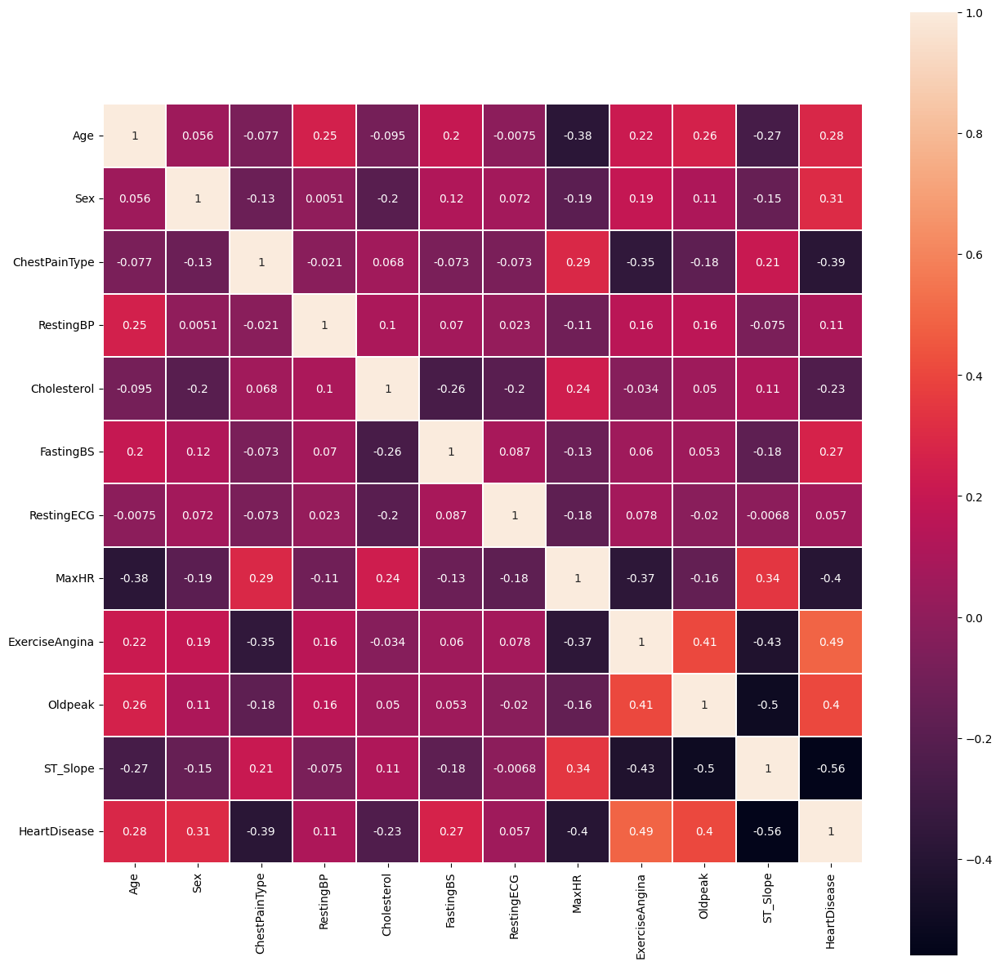

# Heart Failure Prediction
This is a project for BMEN619.

Heart Failure is the current leading cause of death.

This project looks to develop a model for predicting if an obersvation has heart disease or not in an effort to support early detection and prediction. The dataset selected curates 5 independent databases, and can be acced with a free account on Kaggle. This was a csv file gotten from Kaggle <https://www.kaggle.com/datasets/fedesoriano/heart-failure-prediction/data> containing 11 features to predict heart disease and their labels.
1. Age (years)
2. Sex (M: Male or F: Female)
3. ChestPainType: chest pain type (TA: Typical Angina, ATA: Atypical Angina, NAP: Non-Anginal Pain, ASY: Asymptomatic)
4. RestingBP: (mm Hg)
5. Cholestorol (mm/dl)
6. FastingBS: fasting blood sugar (1: >120 mg/dl, 0: <= 120 mg/dl)
7. RestingECG (Normal, ST: having ST-T wave abnormality (T wave inversions and/or ST elevation or depression of > 0.05 mV), LVH: showing probable or definite left ventricular hypertrophy by Estes' criteria)
8. MaxHR (# between 60 and 202)
9. ExerciseAngina: ecercise induced Angina ( Y yes, N no)
10. Oldpeak: ST numeric measured in depression
11. ST_Slope: slope of peak exercise ST segment (Up upsloping, Flat, Down)
12 Heartdisease: output labels (1: heart disease, 0: Normal)

It uses Python as the main tool, with python packages pandas and sci-kit learn being pivotal for development. Fairlearn is a fairness tool based on scikit learn and will be used for evaluation.

Note that although 8 models were tested, only 4 will be used for the project

## Data Exploration
Data was gotten from Kaggle: https://www.kaggle.com/datasets/fedesoriano/heart-failure-prediction

Understanding the general overview and characteristics of the model was important and as such, the exploratory data analysis was performed. This found no missing values, highlighted the breakdown of statistical data as well as the statistical analysis for numerical features.

<table border="1" class="dataframe">
  <thead>
    <tr style="text-align: right;">
      <th></th>
      <th>Age</th>
      <th>RestingBP</th>
      <th>Cholesterol</th>
      <th>FastingBS</th>
      <th>MaxHR</th>
      <th>Oldpeak</th>
      <th>HeartDisease</th>
    </tr>
  </thead>
  <tbody>
    <tr>
      <th>count</th>
      <td>918.000000</td>
      <td>918.000000</td>
      <td>918.000000</td>
      <td>918.000000</td>
      <td>918.000000</td>
      <td>918.000000</td>
      <td>918.000000</td>
    </tr>
    <tr>
      <th>mean</th>
      <td>53.510893</td>
      <td>132.396514</td>
      <td>198.799564</td>
      <td>0.233115</td>
      <td>136.809368</td>
      <td>0.887364</td>
      <td>0.553377</td>
    </tr>
    <tr>
      <th>std</th>
      <td>9.432617</td>
      <td>18.514154</td>
      <td>109.384145</td>
      <td>0.423046</td>
      <td>25.460334</td>
      <td>1.066570</td>
      <td>0.497414</td>
    </tr>
    <tr>
      <th>min</th>
      <td>28.000000</td>
      <td>0.000000</td>
      <td>0.000000</td>
      <td>0.000000</td>
      <td>60.000000</td>
      <td>-2.600000</td>
      <td>0.000000</td>
    </tr>
    <tr>
      <th>25%</th>
      <td>47.000000</td>
      <td>120.000000</td>
      <td>173.250000</td>
      <td>0.000000</td>
      <td>120.000000</td>
      <td>0.000000</td>
      <td>0.000000</td>
    </tr>
    <tr>
      <th>50%</th>
      <td>54.000000</td>
      <td>130.000000</td>
      <td>223.000000</td>
      <td>0.000000</td>
      <td>138.000000</td>
      <td>0.600000</td>
      <td>1.000000</td>
    </tr>
    <tr>
      <th>75%</th>
      <td>60.000000</td>
      <td>140.000000</td>
      <td>267.000000</td>
      <td>0.000000</td>
      <td>156.000000</td>
      <td>1.500000</td>
      <td>1.000000</td>
    </tr>
    <tr>
      <th>max</th>
      <td>77.000000</td>
      <td>200.000000</td>
      <td>603.000000</td>
      <td>1.000000</td>
      <td>202.000000</td>
      <td>6.200000</td>
      <td>1.000000</td>
    </tr>
  </tbody>
</table>

Patterns abd correlations were also highlighted.

## Data Input and Preprocessing
This includes:
* Removing outlier leaving 917 observations
* Numerical data scaling
* Categorical data encoding
* Spliting data 80% development and 20% test.

Stratified K-Fold cross-validation 

Maybe changing age data to ranged categories.

## Experimental Design
Try:
* Logistic Regression
* SVC
* XGradient boosting
* Ada Boost
* KNN
* Random Forest
* MLP Classifier
* Gradient Boosting Classifier

## Metrics for Evaluation
Both performance and fairness metrics were eveluated in this.

Might be broken down into 4 subgroups accross sensitive demographic features of young/old and male/female

### Performance
* Precision
* Recall/sensitivity
* F1-score

### Fairness
Based on age and sex sebsitive features:
* Equal odds differennce and ratio.
* Demographic parity difference and ratio.

### Explainability
* Lime for speed
* shap is good for understanding the global importane (https://shap.readthedocs.io/en/latest/example_notebooks/tabular_examples/model_agnostic/Diabetes%20regression.html)
https://www.datacamp.com/tutorial/explainable-ai-understanding-and-trusting-machine-learning-models

Using python's SHAP package to test the understand the model a bit more. Makes it more explainable using Shapley values

